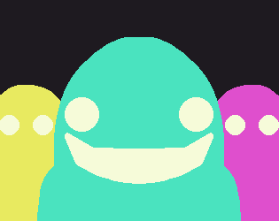

# Little Guys

Help some little guys tackle **big problems**.

## Play the game!

You can find Little Guys on [Itch.io](https://kupajablek.itch.io/little-guys) or, clone the repo and build from source.

## Synopsis

**The Big Guy** is ran by a team of little guys. Complete challenges in various parts of **Big Guys** body to keep him hapy and healthy.

The challenges include:
- Connecting the ideas in his brain
- Refilling oxygen for his system
- Keep the beat of his heart going strong

Do your little guys have what it takes to keep **Big Guy** going?

## Controls

- Use **W,A,S,D** or **Arrow Keys** to move
- **Left Mouse** to click!

## About the Project

This project was created in 1 week as a coding challenge similar to a Game Jam. Our first project as a team has been a certified success!

# Tools and Credits

- Palette: [SLICKO-8](https://lospec.com/palette-list/slicko-8) by [CPTN.PIRANHA](https://lospec.com/cptnpiranha)
- This project was created in [Godot](https://godotengine.org/) 4.4.1.
- All art and assets were crafted with [Aseprite](https://www.aseprite.org/).
- Music and sound effects were produced with [LMMS](https://lmms.io/) and [Audacity](https://www.audacityteam.org/)
